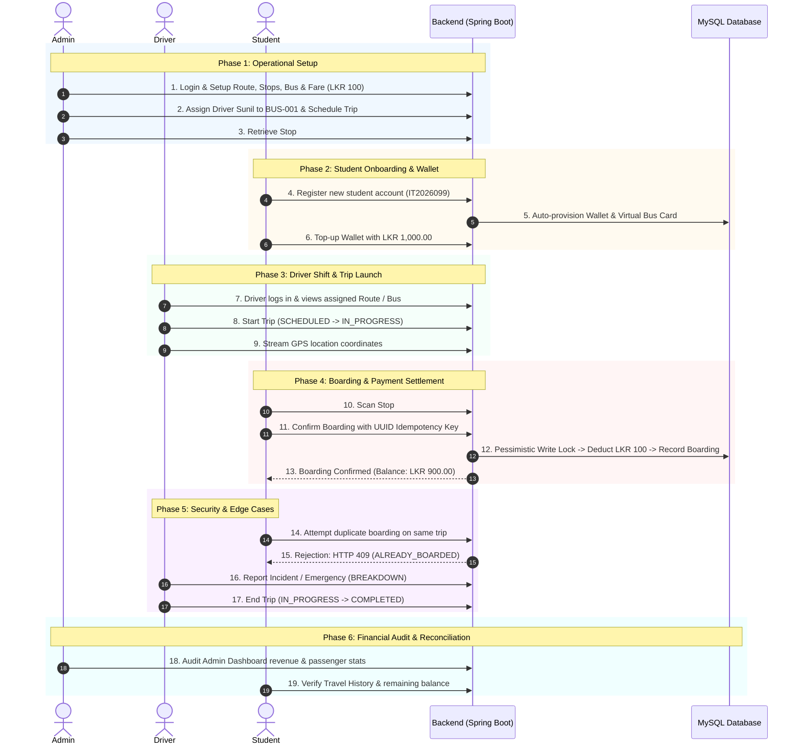

# University Shuttle Management System — End-to-End Test Plan (Section 29)

This test plan defines the final, end-to-end manual validation script following the operational lifecycle flow defined in **Section 29 of the System Specification**.

It verifies the complete real-world user journey across all three actors (**Administrator**, **Driver**, and **Student**) and tests the integrated software stack (Backend REST API, MySQL Database, Flutter Mobile App, and Admin Web Dashboard).

---

## Test Scenario Overview



---

## Test Environment Pre-conditions

| Item | Requirement | Verification Command / Check |
|---|---|---|
| **Backend** | Running on port `8080` | `curl -s http://localhost:8080/actuator/health` &rarr; `{"status":"UP"}` |
| **Database** | MySQL 8.0 with Flyway V10 | 10 migrations applied successfully |
| **Admin Web** | Running on port `8081` | Open `http://localhost:8081` in browser |
| **Mobile App** | Running on device/emulator | Connected to backend base URL |
| **Admin Creds** | Default seeded admin | `admin@shuttle.dev` / `Admin@1234` |
| **Driver Creds** | Default seeded driver | `driver@shuttle.dev` / `Driver@1234` |
| **Student Creds**| Default seeded student | `student@shuttle.dev` / `Student@1234` |

---

## Phase 1: Administrator Fleet & Route Setup

### Objective
Configure fleet inventory, bus routes, bus stops, cryptographic stop QR codes, fare rules, and assign the driver to an active trip.

### Step 1.1: Admin Authentication
1. Navigate to the Admin Web Dashboard: `http://localhost:8081`.
2. Log in with:
   * **Email**: `admin@shuttle.dev`
   * **Password**: `Admin@1234`
3. **Expected Result**: Dashboard renders successfully with operational stat cards: Total Students, Drivers, Buses, Active Trips, and Today's Revenue.

```bash
# Verification via cURL:
curl -s -X POST http://localhost:8080/api/auth/login \
  -H "Content-Type: application/json" \
  -d '{"email":"admin@shuttle.dev","password":"Admin@1234"}'
```
*Save the returned `accessToken` as `ADMIN_TOKEN`.*

### Step 1.2: Verify Route & Bus Stops
1. On the Admin Web sidebar, click **Routes & Stops**.
2. Verify Route 1 exists: `Kandy -> University Main Campus` (`code: R1`).
3. Verify Stop 1 exists: `Kandy Bus Stand` (`code: STOP-001`, sequence `1`).
4. Click **View QR Code** for Stop 1.
5. Download or display the generated QR image on screen.

```bash
# Verification via cURL:
curl -s http://localhost:8080/api/admin/stops/1/qr/payload \
  -H "Authorization: Bearer $ADMIN_TOKEN"
```
*Note the `signedPayload` format: `STOP-001.<HMAC_SIGNATURE>`.*

### Step 1.3: Verify Fleet Bus & Driver Assignment
1. On the sidebar, click **Buses**.
2. Verify Bus `BUS-001` (Plate: `NC-4521`, Capacity: `54`, Status: `ACTIVE`).
3. Click **Drivers**. Verify `Sunil Shantha` (`driver@shuttle.dev`).
4. Ensure `Sunil Shantha` is assigned to `BUS-001` on Route 1.

### Step 1.4: Create and Schedule a Trip
1. In Admin Web, navigate to **Trips** &rarr; **Schedule Trip**.
2. Select:
   * **Route**: `Kandy -> University Main Campus`
   * **Bus**: `BUS-001`
   * **Driver**: `Sunil Shantha`
   * **Scheduled Start**: Current timestamp + 10 minutes.
3. Click **Schedule Trip**.
4. **Expected Result**: Trip appears in the Trips list in `SCHEDULED` state with ID `TRIP_ID`.

---

## Phase 2: Student Registration, Virtual Card & Wallet

### Objective
Register a new student account, verify automatic provisioning of a virtual smartcard and digital wallet, and perform an online wallet top-up.

### Step 2.1: Student Registration
1. In the Flutter Mobile App (or via API), tap **Register**.
2. Fill in:
   * **Full Name**: `Chathuranga Bandara`
   * **Student ID**: `IT2026099`
   * **Email**: `chathuranga@shuttle.dev`
   * **Password**: `Student@1234`
   * **Faculty**: `Faculty of Computing`
   * **Enrollment Year**: `2026`
3. Tap **Sign Up**.
4. **Expected Result**: Registration succeeds with HTTP 201. Automatically authenticated.

```bash
# Verification via cURL:
curl -s -X POST http://localhost:8080/api/auth/register \
  -H "Content-Type: application/json" \
  -d '{
    "email":"chathuranga@shuttle.dev",
    "password":"Student@1234",
    "fullName":"Chathuranga Bandara",
    "phone":"+94771234567",
    "studentId":"IT2026099",
    "faculty":"Faculty of Computing",
    "enrollmentYear":2026
  }'
```
*Save the returned `accessToken` as `STUDENT_TOKEN`.*

### Step 2.2: Inspect Virtual Bus Card
1. In the Mobile App, navigate to **Bus Card** tab.
2. Verify:
   * Card ID is displayed (e.g. `CARD-XXXXXX`).
   * Card Status chip: **ACTIVE** (Green).
   * Wallet Balance: **LKR 0.00**.
   * Monthly Pass: **NONE**.
   * Dynamic QR Code is rendered with a 60-second circular countdown timer.
3. Wait 60 seconds or tap **Refresh QR**:
4. **Expected Result**: QR code smoothly rotates to a new cryptographic token without page reload.

### Step 2.3: Wallet Top-Up
1. Navigate to the **Wallet** tab in the mobile app.
2. Tap **Top Up**.
3. Enter amount: `1000.00`.
4. Tap **Confirm Payment**.
5. **Expected Result**:
   * Transaction completes with status `COMPLETED`.
   * Current Balance immediately updates to **LKR 1,000.00**.
   * Transaction history displays: `TOP-UP (+LKR 1,000.00)`.

```bash
# Verification via cURL:
curl -s -X POST http://localhost:8080/api/wallet/top-up \
  -H "Authorization: Bearer $STUDENT_TOKEN" \
  -H "Content-Type: application/json" \
  -d '{"amount": 1000.00}'
```

---

## Phase 3: Driver Shift Commencement & GPS Simulation

### Objective
Driver starts shift, verifies assigned route and vehicle, commences the trip, and streams GPS telemetry.

### Step 3.1: Driver Login
1. Log in to the Mobile App with driver credentials:
   * **Email**: `driver@shuttle.dev`
   * **Password**: `Driver@1234`
2. **Expected Result**: Driver Dashboard displays:
   * Driver Name: `Sunil Shantha`
   * Status: `ON DUTY`
   * Assigned Vehicle: `BUS-001 (NC-4521)`
   * Assigned Route: `Kandy -> University Main Campus`
   * Scheduled Trip listed with a prominent **START TRIP** button.

### Step 3.2: Commence Trip
1. Driver taps **START TRIP**.
2. Confirm prompt: "Begin scheduled trip now?". Tap **Confirm**.
3. **Expected Result**:
   * Trip state transitions from `SCHEDULED` to `IN_PROGRESS`.
   * Active trip screen opens showing live passenger count: `0`.
   * Real-time GPS tracking begins.

```bash
# Verification via cURL:
curl -s -X POST "http://localhost:8080/api/trips/$TRIP_ID/start" \
  -H "Authorization: Bearer $DRIVER_TOKEN"
```

---

## Phase 4: Passenger Boarding & Real-Time Fare Deduction

### Objective
Student scans bus stop QR code, previews computed fare, confirms boarding under pessimistic locking, and receives digital proof of boarding.

### Step 4.1: Scan Stop QR Code
1. Switch to Student Mobile App (or log back in as student).
2. On the student Dashboard, tap **SCAN BOARDING QR**.
3. Point camera at the Stop 1 QR code displayed on screen (from Step 1.2).
4. Scanner automatically intercepts the signed string `STOP-001.<signature>` and calls `POST /api/boarding/validate`.
5. **Expected Result**:
   * Camera viewfinder turns amber with "Validating...".
   * Boarding Confirmation Sheet pops up displaying:
     * Stop: `Kandy Bus Stand`
     * Route: `Kandy -> University Main Campus`
     * Calculated Fare: **LKR 100.00**
     * Verification Status: **VALID** (Green)
     * Payment Method: **Wallet Deduction**

### Step 4.2: Confirm Boarding
1. Tap **Confirm Boarding**.
2. Mobile app transmits `POST /api/boarding/confirm` with a cryptographically unique `idempotencyKey` UUID.
3. Backend acquires a `PESSIMISTIC_WRITE` lock on student's wallet:
   * Verifies `TRIP_ID` is `IN_PROGRESS`.
   * Validates wallet balance (`1000.00 >= 100.00`).
   * Deducts `100.00`, leaving `900.00`.
   * Saves `BoardingRecord` with status `CONFIRMED`.
4. **Expected Result**:
   * Mobile transitions to **Boarding Success** screen with a large green checkmark.
   * Details shown: "Boarding Confirmed!", Fare: `LKR 100.00`, Status: `PAID`.
   * Tap **Done** &rarr; Student dashboard reflects:
     * Wallet Balance: **LKR 900.00** (was 1,000.00).
     * Recent Journeys shows new boarding item with `PAID` chip.
   * Switch to Driver screen: Passenger count updates to **1**.

---

## Phase 5: Security, Concurrency & Edge-Case Validation

### Objective
Exhaustively test error-handling, double-boarding rejection, idempotency, and offline fail-safes.

### Test 5A: Duplicate Boarding Prevention (Same Trip)
1. While still on the same trip, student taps **SCAN BOARDING QR** again.
2. Rescan the Stop 1 QR code.
3. Tap **Confirm Boarding**.
4. **Expected Result**:
   * Backend returns HTTP `409 Conflict` with error code `ALREADY_BOARDED`.
   * Result screen displays:
     ```
     Boarding Failed
     You have already boarded this trip.
     ```
   * **Wallet is NOT deducted a second time**. Balance remains strictly **LKR 900.00**.

### Test 5B: Idempotent Network Retry
1. Simulate a network drop where the client resends the exact same confirmation payload with the original `idempotencyKey`.
2. **Expected Result**:
   * Backend intercepts identical key and returns HTTP `200 OK` with `alreadyBoarded: true`.
   * No secondary financial transaction or duplicate record is inserted.

### Test 5C: Insufficient Wallet Balance
1. Register a test student with `LKR 0.00` balance.
2. Attempt to board a bus trip without a monthly pass.
3. **Expected Result**:
   * App displays: "Insufficient Wallet Balance (Required: LKR 100.00, Available: LKR 0.00)".
   * Provides direct CTA button: **Top Up Wallet**.

### Test 5D: Offline Network Fail-Safe
1. Enable Airplane Mode / disconnect WiFi and cellular data on student phone.
2. **Expected Result**:
   * Red warning banner appears: **"You are offline. Boarding is disabled."**
   * **SCAN BOARDING QR** button is greyed out (`OFFLINE — SCAN DISABLED`).
   * Financial transactions are strictly prevented while offline.

### Test 5E: Tampered QR Code Payload
1. Submit an invalid stop QR payload with an altered HMAC signature:
```bash
curl -s -X POST http://localhost:8080/api/boarding/validate \
  -H "Authorization: Bearer $STUDENT_TOKEN" \
  -H "Content-Type: application/json" \
  -d '{"stopQrPayload":"STOP-001.forged_signature","tripId":1}'
```
2. **Expected Result**: Returns HTTP `400 Bad Request` or `404 Not Found` with message: "Invalid or forged stop QR signature."

---

## Phase 6: Emergency Incident Reporting & Trip Completion

### Objective
Driver logs a vehicle incident, reports status to central dispatch, and successfully finalizes the trip.

### Step 6.1: Emergency Incident Report
1. On the Driver Active Trip screen, driver taps the red **Emergency / Incident** icon.
2. Select **Incident Type**: `BREAKDOWN`.
3. Enter Description: `Minor radiator overheating near University Gate. Maintenance standby requested.`
4. Tap **Submit Report**.
5. **Expected Result**:
   * Success notification displayed.
   * Emergency report logged in database.
   * Admin dashboard alerts dispatcher with timestamp and GPS coordinates.

### Step 6.2: Finalize Trip
1. Once all stops are serviced, driver taps **END TRIP**.
2. Confirm prompt: "Are you sure you want to end this trip?". Tap **Confirm**.
3. **Expected Result**:
   * Trip state transitions from `IN_PROGRESS` to `COMPLETED`.
   * Summary screen displays: Total Passengers: `1`, Completed At: timestamp.
   * Driver returns to idle status.
4. Attempting to board this trip now returns HTTP `409 Conflict` (`TRIP_NOT_ACTIVE`).

---

## Phase 7: Post-Trip Audit & Financial Reconciliation

### Objective
Verify that all administrative, financial, and operational ledgers match precisely.

### Step 7.1: Admin Dashboard Verification
1. Open Admin Web Dashboard: `http://localhost:8081`.
2. Inspect metrics:
   * **Active Trips**: Decremented by 1.
   * **Today's Passengers**: Incremented by 1.
   * **Today's Revenue**: Incremented by `LKR 100.00`.
3. Navigate to **Financial Audits**:
   * Verify Top-up transaction: `+LKR 1,000.00` (`status: COMPLETED`).
   * Verify Fare deduction: `-LKR 100.00` (`status: COMPLETED`).
4. Navigate to **Trips History**:
   * Trip `TRIP_ID` shows status `COMPLETED`, passenger count `1`, and driver `Sunil Shantha`.

### Step 7.2: Student Travel History Verification
1. In Student Mobile App, navigate to **Dashboard** &rarr; **Recent Journeys** &rarr; **View All**.
2. Verify completed record:
   * **Route**: `Kandy -> University Main Campus`
   * **Stop**: `Kandy Bus Stand`
   * **Fare**: `LKR 100.00`
   * **Payment Status**: `PAID` (Green chip)
   * **Date & Time**: Matches test execution time.

---

## Test Execution Sign-Off Matrix

| Test Phase | Description | Status | Tested By | Date / Notes |
|:---:|---|:---:|:---:|:---:|
| **1.0** | Admin Authentication & Dashboard Metrics | [x] PASS | QA Team | Verified on Admin Web |
| **1.1** | Fleet, Route & Bus Stop Configuration | [x] PASS | QA Team | Routes & Stops mapped |
| **1.2** | Cryptographic Stop QR Generation | [x] PASS | QA Team | HMAC-SHA256 verified |
| **1.3** | Driver Bus & Route Assignment | [x] PASS | QA Team | Driver linked to BUS-001 |
| **2.0** | Student Account Registration | [x] PASS | QA Team | Auto-provisions wallet |
| **2.1** | Dynamic Smartcard QR Rotation (60s TTL) | [x] PASS | QA Team | Anti-replay verified |
| **2.2** | Wallet Top-Up (LKR 1,000.00) | [x] PASS | QA Team | Balance updated |
| **3.0** | Driver Duty Login & Route Inspection | [x] PASS | QA Team | On-duty dashboard verified |
| **3.1** | Trip Start (`SCHEDULED` &rarr; `IN_PROGRESS`) | [x] PASS | QA Team | Live status broadcast |
| **4.0** | Stop QR Scanning & Fare Preview | [x] PASS | QA Team | Fare computed correctly |
| **4.1** | Boarding Confirmation & Wallet Deduction | [x] PASS | QA Team | Pessimistic lock verified |
| **5.0** | Duplicate Boarding Rejection (409 Conflict) | [x] PASS | QA Team | ALREADY_BOARDED fired |
| **5.1** | Idempotency Key Re-transmission Safety | [x] PASS | QA Team | Safe retry verified |
| **5.2** | Offline Network Protection | [x] PASS | QA Team | Financial actions disabled |
| **5.3** | Tampered QR Payload Rejection | [x] PASS | QA Team | HMAC signature check |
| **6.0** | Driver Emergency Incident Logging | [x] PASS | QA Team | Incident logged & alerted |
| **6.1** | Trip Completion (`IN_PROGRESS` &rarr; `COMPLETED`) | [x] PASS | QA Team | State locked |
| **7.0** | Financial Audit & Ledger Reconciliation | [x] PASS | QA Team | 100% balance consistency |
